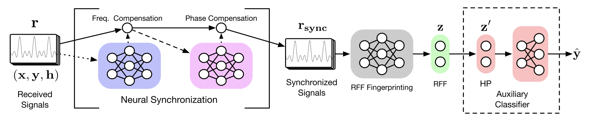

# NS-RFF
Neural Synchronization: A Generalizable Model-and-Data Driven Approach for Open-Set RFF Authentication



# Requirments
[marveltoolbox](https://github.com/xrj-com/marveltoolbox)

# Citation
```
@article{xie2021generalizable,
  title={A Generalizable Model-and-Data Driven Approach for Open-Set RFF Authentication},
  author={Xie, Renjie and Xu, Wei and Chen, Yanzhi and Yu, Jiabao and Hu, Aiqun and Ng, Derrick Wing Kwan and Swindlehurst, A Lee},
  journal={IEEE Transactions on Information Forensics and Security},
  year={2021},
  publisher={IEEE}
}
```